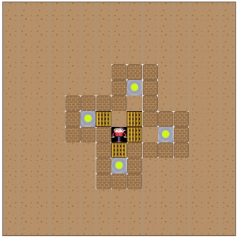

# 推箱子小游戏:package:
> Vue 2.0 + Jquery 开发的推箱子小游戏



### 游戏规则
- 把散乱在各处的箱子推回它原来的位置即可获得胜利

### 实现思路
1. 整体思路
  - 可以把屏幕中央的方格抽象成一个坐标系，左上角向右为x轴正方向，向下为y轴正方向。
  - 通过坐标控制地图的渲染、角色的移动和箱子的移动。
2. 地图
  - 地图的初始状态写在`levels.js`文件中，包括关卡编号、地图围墙、角色初始位置、箱子初始位置和箱子的目的地
  - 网页加载时利用Vue的`v-for`把这些位置的相应图标渲染出来并动态绑定`id`
  - 目前游戏只有一关，想玩其他关卡，把相应关卡地图的坐标写入文件即可
3. 角色行为
  - 游戏开始后开始监听键盘事件，在按上下左右键时触发`go()`方法，修改角色坐标，替换相应图标以达到角色移动的目的
  - 每一次角色移动都会判断下一步的位置，如果是墙，则终止行为，如果是箱子，则跟随角色一起移动
4. 胜利
  - 每一次角色行为结束就判断箱子位置与终点位置是否相同，若完全相同则游戏胜利

### 目录结构
```bash
public
├── index.html  # 入口网页
├── imgs  # 地图各部分的图标
|   ├── box.png # 箱子图标
│   ├── floor.png  # 地板图标
│   ├── wall.png  # 墙壁图标
│   ├── finish.png  # 终点图标
│   └── push.ico  # 标签页icon
├── index.js  # 入口脚本(Vue实例)
├── levels.js  # 关卡脚本(存放关卡信息)
└── style.css  # 样式表
```

### 本地开发
```bash
git clone https://github.com/JserShadow/push-box.git
npm i
node app.js
# 或者安装  nodemon(不需要每次修改都重新启动服务)
npm i -g nodemon
nodemon app.js
# 该服务监听8080端口(请在PC端浏览器打开)
```
> :warning:Tips: 如果你觉得现在的图标比较丑，可以直接替换`/public/imgs`里的图片(具体对应关系参考上面的目录结构，不要修改文件名)，想玩其他关卡或者自定义关卡的同学可以修改`levels.js`的内容

---


